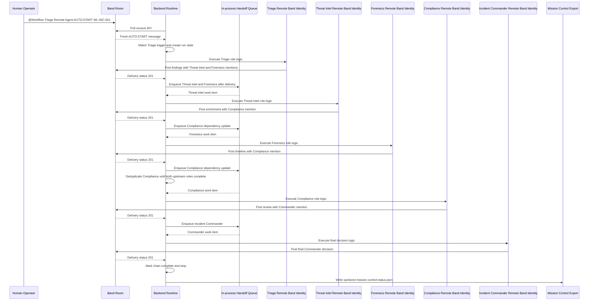

# Workflow Legion: Cyber Incident Command Room

Workflow Legion is a Band-native multi-agent cyber incident response system built for the Band of Agents Hackathon.

It demonstrates how specialized incident-response agents can coordinate in a shared Band room, hand off work through @mentions, preserve visible context, and produce an auditable Commander decision for a high-stakes security incident.

## Mission

Build a SOC-style cyber incident command room where specialized AI agents collaborate through Band to:

- triage security alerts,
- enrich threat intelligence,
- review forensic evidence,
- assess compliance and escalation risk,
- and produce an auditable incident commander decision.

## Core Principle

Band is the collaboration layer.

Agents must communicate, share context, delegate work, and hand off responsibility through Band rooms and Band messages.

Band is not a final notification channel. It is the shared coordination fabric.

## Current Validated Proof

Workflow Legion has validated five remote Band agent identities posting into the Band command room through role-specific Band Agent API keys.

Current validated proof:

- Alert Triage Agent delivered true.
- Threat Intel Agent delivered true.
- Forensics Agent delivered true.
- Compliance Agent delivered true.
- Incident Commander Agent delivered true.
- No fallback mention-resolution errors were observed.

Final proof screenshot:

```text
docs/screenshots/proof-five-remote-agents-band-post.png
```

Validated repo state:

- deterministic backend workflow,
- autonomous Band runtime path,
- static frontend showcase,
- final demo documentation,
- QA/sponsor safety docs,
- final report validation,
- remote Band agent readiness audit.

Validated locally:

- FastAPI backend booted successfully.
- `GET /health` responded successfully.
- `POST /api/band/test-message` delivered a Band message with HTTP 201.
- `POST /api/incidents/wl-inc-001/start` with `post_to_band=true` delivered deterministic workflow messages through the configured Band client path.
- Band participant lookup and dynamic mention resolution are implemented.
- `.env` and `backend/.env` remain ignored.
- `.env.example` contains placeholders only.
- Backend tests pass.
- The frontend showcase builds successfully.

Important proof boundary:

Earlier proof validated the remote Triage Agent. Later proof validated Triage plus Threat Intel. Current proof validates all five remote Band identities posting into the Band command room through role-specific Band Agent API keys.

The backend remains a deterministic workflow/runtime layer. Band remains the visible collaboration fabric where role handoffs, messages, mentions, shared context, and task state are shown.

This proof does not overclaim autonomous live reasoning beyond the validated deterministic workflow plus remote Band identity posting proof.

## Incident Scenario

Demo incident:

```text
WL-INC-001
```

Scenario details:

- Suspicious PowerShell activity.
- Possible data exfiltration.
- Host: `FIN-042`.
- User: `j.morgan`.
- Risk area: finance data exposure.
- Outcome: high-severity containment recommendation.

## Agent Team

### Alert Triage Agent

Receives the WL-INC-001 alert, classifies severity, identifies affected host/user, and starts the response chain.

Outputs:

- severity,
- incident summary,
- initial evidence needs,
- handoff targets.

### Threat Intel Agent

Enriches suspicious indicators, checks likely attack behavior, and assesses external risk.

Outputs:

- IOC context,
- likely threat behavior,
- risk notes.

### Forensics Agent

Reviews host activity, PowerShell behavior, process evidence, file activity, and timeline clues.

Outputs:

- host timeline,
- evidence summary,
- forensic confidence.

### Compliance Agent

Reviews audit requirements, evidence completeness, reporting implications, and escalation risk.

Outputs:

- compliance notes,
- audit checklist,
- disclosure or escalation recommendation.

### Incident Commander Agent

Synthesizes all findings and issues the final command decision.

Outputs:

- contain/escalate/monitor decision,
- final report summary,
- next actions.

## MVP Demo Flow

1. Start the WL-INC-001 incident simulation.
2. Triage Agent posts the alert into the Band room.
3. Triage hands off investigation work through visible role text and Band mentions.
4. Threat Intel enriches indicators.
5. Forensics reviews endpoint evidence and builds a timeline.
6. Compliance checks audit and escalation risk.
7. Commander produces the final incident decision report.
8. Final state and report are available through backend state and the sanitized Mission Control export.

## Proposed Stack

- Band - core collaboration fabric and command room.
- FastAPI - backend runtime and API layer.
- Python - agent workflow/runtime logic.
- Deterministic workflow outputs - safe MVP replay path and runtime guardrail.
- LangGraph - optional internal per-agent orchestration only, not the cross-agent coordination layer.
- React / Vite - judge-facing dashboard/showcase.
- Redis + ARQ - optional future async job queue, not the active runtime path.
- Supabase Postgres or SQLite - optional future persistence layer, not the active runtime path.
- Native.Builder / NativelyAI - showcase and productization layer.
- AI/ML API - optional model-provider support path.
- Featherless - optional open-model provider support path.

## Architecture

Workflow Legion uses Band as its core collaboration fabric. The current runtime separates three concerns:

- Band coordinates visible room messages, role identity, @mentions, handoffs, shared context, and proof.
- The backend executes deterministic workflow/state-machine logic, persists local JSON state, and advances downstream work with an in-process handoff queue after successful Band delivery.
- Mission Control reads a sanitized JSON export and does not coordinate agents.

Redis/ARQ and SQLite/Postgres are future/optional infrastructure, not active runtime paths.

```mermaid
graph TB

    HumanOp(["Human Operator"])

    subgraph BandG["Band Collaboration Fabric"]
        BandRoom["Band Room - visible messages, mentions, handoffs, shared context"]
        RemoteIds["Role-specific remote Band agent identities"]
    end

    subgraph BackendG["Current Backend Runtime"]
        BackendRun["Autonomous runtime / state machine"]
        HandoffQueue["In-process handoff queue"]
        LocalState[("Local JSON state: .workflow-legion-state/")]
        SafeExport["Sanitized Mission Control export"]
    end

    subgraph AgentsG["Workflow Legion agents"]
        TriageAg["Triage Agent"]
        ThreatAg["Threat Intel Agent"]
        ForenAg["Forensics Agent"]
        ComplAg["Compliance Agent"]
        CommdrAg["Incident Commander Agent"]
    end

    subgraph FrontendG["Showcase / Mission Control"]
        FrontendApp["React/Vite frontend showcase"]
    end

    subgraph ProvidersG["Optional provider support layers"]
        AIMLAPI["AI/ML API - optional role reasoning"]
        Featherless["Featherless - optional open-model reasoning"]
    end

    subgraph FutureG["Future / optional infrastructure - not active runtime path"]
        RedisQueue[("Redis + ARQ")]
        SQLStore[("SQLite / Postgres")]
    end

    HumanOp -->|fresh AUTO:START in Band| BandRoom
    BandRoom -->|backend polls receive API| BackendRun
    BackendRun -->|posts through remote identities| RemoteIds
    RemoteIds -->|visible role posts| BandRoom

    BackendRun -->|successful Band delivery unlocks next work| HandoffQueue
    HandoffQueue -->|deterministic downstream execution| BackendRun
    BackendRun -->|writes| LocalState
    BackendRun -->|writes sanitized status| SafeExport
    FrontendApp -->|polls local JSON export| SafeExport

    BackendRun -.->|provider calls when configured| AIMLAPI
    BackendRun -.->|provider calls when configured| Featherless

    TriageAg -.->|role output appears through Band identity| BandRoom
    ThreatAg -.->|role output appears through Band identity| BandRoom
    ForenAg -.->|role output appears through Band identity| BandRoom
    ComplAg -.->|role output appears through Band identity| BandRoom
    CommdrAg -.->|final decision appears through Band identity| BandRoom

    BackendRun -. future optional .-> RedisQueue
    BackendRun -. future optional .-> SQLStore

    style BandRoom fill:#ffccbc,stroke:#bf360c,stroke-width:3px,color:#000000
    style RemoteIds fill:#ffccbc,stroke:#bf360c,stroke-width:2px,color:#000000
    style BackendRun fill:#c8e6c9,stroke:#1b5e20,stroke-width:2px,color:#000000
    style HandoffQueue fill:#c8e6c9,stroke:#1b5e20,stroke-width:2px,color:#000000
    style LocalState fill:#c8e6c9,stroke:#1b5e20,stroke-width:2px,color:#000000
    style SafeExport fill:#bbdefb,stroke:#0d47a1,stroke-width:2px,color:#000000
    style FrontendApp fill:#bbdefb,stroke:#0d47a1,stroke-width:2px,color:#000000
    style AIMLAPI fill:#f3e5f5,stroke:#6a1b9a,stroke-width:2px,color:#000000
    style Featherless fill:#f3e5f5,stroke:#6a1b9a,stroke-width:2px,color:#000000
    style RedisQueue fill:#eeeeee,stroke:#757575,stroke-dasharray: 5 5,color:#000000
    style SQLStore fill:#eeeeee,stroke:#757575,stroke-dasharray: 5 5,color:#000000
```





Current implementation notes:

- Band is the collaboration fabric and proof surface.
- The backend polls Band receive for a fresh human `AUTO:START`.
- The backend executes deterministic runtime/state-machine logic.
- Downstream execution uses an in-process handoff queue after successful visible Band delivery.
- Runtime state is local JSON under `.workflow-legion-state/`.
- Mission Control reads a sanitized `mission-control-status.json` export.
- AI/ML API and Featherless are optional provider support layers.
- Redis/ARQ and SQLite/Postgres are future/optional infrastructure, not active runtime paths.

## Backend Endpoints

Useful endpoints:

```text
GET  /health
GET  /api/incidents/wl-inc-001
POST /api/incidents/wl-inc-001/reset
POST /api/incidents/wl-inc-001/start
GET  /api/incidents/wl-inc-001/report
POST /api/band/test-message
```

Start the incident workflow with Band posting enabled:

```powershell
Invoke-RestMethod `
  -Method Post `
  -Uri http://127.0.0.1:8000/api/incidents/wl-inc-001/start `
  -ContentType "application/json" `
  -Body '{"reset": true, "post_to_band": true}' |
  ConvertTo-Json -Depth 20
```

Proof note:

This path posts deterministic workflow messages through the configured Band client path. The final proof screenshot separately validates all five remote Band identities posting into the Band command room through role-specific Band Agent API keys.

## Current Backend Progress

Implemented:

- Typed incident, finding, evidence, timeline, and final report models.
- Deterministic outputs for Triage, Threat Intel, Forensics, Compliance, and Commander.
- In-memory incident state for the WL-INC-001 demo.
- Final incident report generation.
- Band client wrapper using the required Band payload shape.
- Live Band participant lookup.
- Dynamic mention resolution by handle.
- Handle normalization with or without `@`.
- Smoke endpoint for Band delivery testing.
- Incident workflow posting through the same Band client path.
- Explicit fallback behavior when role agents are not yet Band participants.

Issue coverage:

- #3 - Band room and test message path.
- #6 - Alert/Triage Agent path.
- #11 - Band mention handoff flow.
- #12 - incident state and findings storage for MVP.
- #13 - final incident report output.
- #28 - deterministic mock outputs for all five agents.
- #29 - backend health, settings, provider router imports, and demo endpoint validation.
- #34 - remote Band Agent API smoke proof progression.

## Validation Commands

Backend validation:

```powershell
backend\.venv\Scripts\python.exe -m unittest discover -s tests -v
```

Frontend showcase validation:

```powershell
cd frontend-showcase
npm install
npm run build
cd ..
```

Expected result: all discovered tests pass and the frontend showcase builds successfully.

## Submission and Validation Docs

Key docs:

- `docs/demo-script.md`
- `docs/demo-shot-list.md`
- `docs/demo-checklist.md`
- `docs/qa-observer-notes.md`
- `docs/sponsor-redemption-checklist.md`
- `docs/final-report-validation.md`
- `docs/remote-band-agent-readiness.md`
- `docs/natively-export-audit.md`
- `docs/tool-usage-doctrine.md`
- `docs/sponsor-credit-strategy.md`
- `docs/natively-builder-showcase.md`

## Validated Integration Notes

### Band + AI/ML API Validation

Workflow Legion's target architecture is a Band remote-agent system.

Agents run from this repository and connect to Band through the Band API. Band provides the shared command room, participant identity, @mention routing, visible handoffs, shared context, and collaboration audit trail.

During early Band validation, the team confirmed that a Triage Agent could generate a structured WL-INC-001 response using AI/ML API-backed inference.

That internal-agent test is retained as sponsor validation and model-provider proof, but it is not the final runtime architecture.

Current integration direction:

- Band - core remote-agent collaboration fabric.
- Python/FastAPI - agent runtime, deterministic incident workflow, and API layer.
- AI/ML API - validated model-provider path for Band-connected reasoning experiments.
- Featherless - optional open-model provider support path.
- Native.Builder / NativelyAI - showcase and productization layer, not the core runtime.

## Static Showcase Page

A static judge-facing showcase page exists under:

```text
frontend-showcase/
```

Current showcase sections:

- Hero
- Mission Control
- Problem / Solution
- Agent Team
- Demo Flow
- Architecture
- Sponsor Tools
- Native.Builder section
- Team
- Final CTA
- Footer

Showcase principles:

- Static-first, with optional sanitized local Mission Control JSON polling.
- No backend calls.
- No Supabase.
- No forms.
- No authentication.
- No API keys or credentials.
- No sponsor codes or QR links.
- Band remains the core collaboration layer.
- Native.Builder packages the story and presentation; it does not coordinate the agents.

## Live Mission Control View

The frontend showcase can optionally display a sanitized local Mission Control export from the autonomous runtime.

The backend writes raw runtime state under:

```text
.workflow-legion-state\mission-control-status.json
```

For the frontend showcase, use the safe export flag:

```powershell
backend\.venv\Scripts\python.exe backend\run_autonomous_agents.py --run-id studio-001 --poll-interval 3 --max-turns 8 --message-limit 25 --stop-after-complete --debug-receive --frontend-studio-export frontend-showcase\public\mission-control-status.json
```

Then run the frontend showcase:

```powershell
cd frontend-showcase
npm run dev
```

The live export is ignored by git. The committed sample at `frontend-showcase\public\mission-control-status.example.json` uses fake demo values only. If `frontend-showcase\public\mission-control-status.json` is missing, the Mission Control section falls back to built-in demo data and keeps polling for the live export every 2.5 seconds.

The export is intentionally sanitized. It contains incident/run status, role summaries, provider names, handoff targets, Commander decision status, timestamps, and safe delivery status. It does not include API keys, Band receive keys, Band agent IDs, chat IDs, room IDs, sponsor codes, QR codes, redemption links, `.env` values, or local private paths.

Local showcase build note:

- Path: `frontend-showcase/`
- Stack: Vite + React + TypeScript.
- Validation: `npm install`; `npm run build`.
- Purpose: static hackathon/productization showcase.
- Safety: no backend calls, no Supabase, no auth, no forms, no API keys, no environment files, and no secrets.

Native.Builder / NativelyAI was used as a showcase/productization path. The local `frontend-showcase/` remains the validated submission showcase, while the downloaded Natively source export is documented in `docs/natively-export-audit.md` as a backup/proof artifact.

The showcase currently states the honest proof level:

Workflow Legion now has five validated remote Band agent identities posting into the Band command room through role-specific Band Agent API keys. The backend workflow remains deterministic and repeatable for judging.

## Remote Band Agent Readiness

The current smoke proof validates all five remote Band agent identities posting into the Band command room through role-specific Band Agent API keys:

- Triage delivered true.
- Threat Intel delivered true.
- Forensics delivered true.
- Compliance delivered true.
- Incident Commander delivered true.
- No fallback mention-resolution errors were observed.

The deterministic five-agent backend workflow is validated by tests and supports reliable replay for judging.

Submission safety gate:

- backend tests pass,
- no `.env`, API keys, sponsor codes, QR codes, `node_modules`, `dist`, or build output are committed,
- the demo describes Band as the core collaboration fabric,
- the demo does not claim autonomous live reasoning beyond the validated deterministic workflow and remote Band identity proof.

## Screenshot Archive

Recommended screenshot archive path:

```text
docs/screenshots/
```

Current proof screenshot:

```text
docs/screenshots/proof-five-remote-agents-band-post.png
```

Suggested screenshot caption:

Five Workflow Legion remote Band agent identities posting WL-INC-001 role-specific workflow messages into the Band command room through role-specific Band Agent API keys.

Additional screenshots to capture before final submission:

- Band room proof showing Triage, Threat Intel, Forensics, Compliance, and Incident Commander posts.
- Band message timeline showing WL-INC-001 workflow posts.
- FastAPI `/health` response.
- FastAPI `post_to_band=true` incident response.
- GitHub repository README.
- GitHub project board.
- Static showcase landing page hero.
- Static showcase architecture section.
- Static showcase sponsor tools section.

## Safety Notes

Do not commit:

- `.env`
- `backend/.env`
- API keys
- sponsor codes
- QR redemption links
- screenshots containing secrets
- local databases
- logs
- `__pycache__`
- `node_modules`
- `dist`
- build output
- private credentials
- private redemption links

Use `.env` locally and keep `.env.example` as placeholders only.

`POST /api/band/test-message` returns a configuration error instead of attempting live delivery when Band credentials are missing.

## Local Backend Quickstart

From the backend directory:

```powershell
cd backend
.\.venv\Scripts\python.exe -m uvicorn app.main:app --reload
```

Health check:

```powershell
Invoke-RestMethod `
  -Method Get `
  -Uri http://127.0.0.1:8000/health |
  ConvertTo-Json -Depth 10
```

Band smoke test:

```powershell
Invoke-RestMethod `
  -Method Post `
  -Uri http://127.0.0.1:8000/api/band/test-message `
  -ContentType "application/json" `
  -Body '{"content":"@redhood Workflow Legion backend smoke test: Triage Agent online."}' |
  ConvertTo-Json -Depth 10
```

## Hackathon Positioning

Workflow Legion targets the Regulated & High-Stakes Workflows track.

The project demonstrates:

- clear role specialization,
- visible multi-agent handoffs,
- Band-native coordination,
- audit-ready incident context,
- command decision synthesis,
- and a practical business use case for SOC and compliance teams.

## Final Submission Narrative

Workflow Legion turns fragmented incident response into a coordinated command room.

Instead of hidden handoffs, scattered alerts, and unclear ownership, the system uses Band as the visible collaboration layer where agents can route work, preserve shared context, and produce an auditable final decision.

The current demo proves the critical path:

```text
Backend workflow
-> Band Agent API
-> five role-specific remote Band agent identities
-> shared Band command room
-> visible incident handoff messages
-> deterministic five-agent final report
```

## Honest Claim Boundary

Allowed:

- Workflow Legion now has five validated remote Band agent identities posting into the Band command room through role-specific Band Agent API keys.
- The deterministic five-agent workflow is validated in the backend.
- Band coordinates the agent workflow.
- The backend executes deterministic workflow/runtime logic.
- Native.Builder / NativelyAI supports showcase/productization.
- AI/ML API and Featherless are optional provider support paths.
- The proof screenshot shows five role-specific remote Band agent posts.

Do not claim:

- open-ended autonomous live reasoning has been proven,
- Band is only a notification layer,
- provider APIs are required for the validated proof,
- Native.Builder coordinates agents,
- Workflow Legion prevents breaches,
- Workflow Legion replaces SOC teams,
- Workflow Legion gives final legal or regulatory advice.
