# Architecture Flow - System Context

This diagram separates the current validated implementation from optional/future infrastructure. Band remains the core collaboration fabric and visible proof surface. The backend owns deterministic runtime/state-machine logic, local JSON state, and the in-process handoff queue.

```mermaid
graph TB

    HumanOp(["Human Operator"])

    subgraph BandG["Band Collaboration Fabric"]
        BandRoom["Band Room - visible messages, mentions, handoffs, shared context"]
        RemoteIds["Role-specific remote Band agent identities"]
    end

    subgraph BackendG["Current Backend Runtime"]
        BackendRun["Autonomous runtime / state machine"]
        HandoffQueue["In-process handoff queue"]
        LocalState[("Local JSON state: .workflow-legion-state/")]
        SafeExport["Sanitized Mission Control export"]
    end

    subgraph AgentsG["Workflow Legion agents"]
        TriageAg["Triage Agent"]
        ThreatAg["Threat Intel Agent"]
        ForenAg["Forensics Agent"]
        ComplAg["Compliance Agent"]
        CommdrAg["Incident Commander Agent"]
    end

    subgraph FrontendG["Showcase / Mission Control"]
        FrontendApp["React/Vite frontend showcase"]
    end

    subgraph ProvidersG["Optional provider support layers"]
        AIMLAPI["AI/ML API - optional role reasoning"]
        Featherless["Featherless - optional open-model reasoning"]
    end

    subgraph FutureG["Future / optional infrastructure - not active runtime path"]
        RedisQueue[("Redis + ARQ")]
        SQLStore[("SQLite / Postgres")]
    end

    HumanOp -->|fresh AUTO:START in Band| BandRoom
    BandRoom -->|backend polls receive API| BackendRun
    BackendRun -->|posts through remote identities| RemoteIds
    RemoteIds -->|visible role posts| BandRoom

    BackendRun -->|successful Band delivery unlocks next work| HandoffQueue
    HandoffQueue -->|deterministic downstream execution| BackendRun
    BackendRun -->|writes| LocalState
    BackendRun -->|writes sanitized status| SafeExport
    FrontendApp -->|polls local JSON export| SafeExport

    BackendRun -.->|provider calls when configured| AIMLAPI
    BackendRun -.->|provider calls when configured| Featherless

    TriageAg -.->|role output appears through Band identity| BandRoom
    ThreatAg -.->|role output appears through Band identity| BandRoom
    ForenAg -.->|role output appears through Band identity| BandRoom
    ComplAg -.->|role output appears through Band identity| BandRoom
    CommdrAg -.->|final decision appears through Band identity| BandRoom

    BackendRun -. future optional .-> RedisQueue
    BackendRun -. future optional .-> SQLStore

    style BandRoom fill:#ffccbc,stroke:#bf360c,stroke-width:3px,color:#000000
    style RemoteIds fill:#ffccbc,stroke:#bf360c,stroke-width:2px,color:#000000
    style BackendRun fill:#c8e6c9,stroke:#1b5e20,stroke-width:2px,color:#000000
    style HandoffQueue fill:#c8e6c9,stroke:#1b5e20,stroke-width:2px,color:#000000
    style LocalState fill:#c8e6c9,stroke:#1b5e20,stroke-width:2px,color:#000000
    style SafeExport fill:#bbdefb,stroke:#0d47a1,stroke-width:2px,color:#000000
    style FrontendApp fill:#bbdefb,stroke:#0d47a1,stroke-width:2px,color:#000000
    style AIMLAPI fill:#f3e5f5,stroke:#6a1b9a,stroke-width:2px,color:#000000
    style Featherless fill:#f3e5f5,stroke:#6a1b9a,stroke-width:2px,color:#000000
    style RedisQueue fill:#eeeeee,stroke:#757575,stroke-dasharray: 5 5,color:#000000
    style SQLStore fill:#eeeeee,stroke:#757575,stroke-dasharray: 5 5,color:#000000
```

Current implementation notes:

- Band is the collaboration fabric and proof surface.
- The backend polls Band receive for a fresh human `AUTO:START`.
- The backend executes deterministic runtime/state-machine logic.
- Downstream execution uses an in-process handoff queue after successful visible Band delivery.
- Runtime state is local JSON under `.workflow-legion-state/`.
- Mission Control reads a sanitized `mission-control-status.json` export.
- AI/ML API and Featherless are optional provider support layers.
- Redis/ARQ and SQLite/Postgres are future/optional infrastructure, not active runtime paths.
