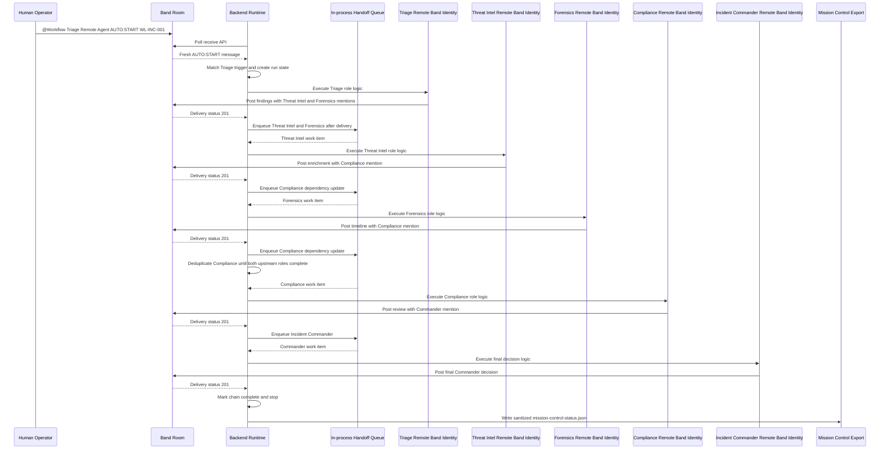

# Incident Sequence - WL-INC-001

This sequence shows the current validated live path. Band is the visible collaboration fabric. The backend executes deterministic runtime logic, stores local JSON state, and advances downstream work through an in-process handoff queue after successful visible Band delivery.

Sequence boundary notes:

- Band provides the shared room, visible posts, mentions, handoffs, and proof surface.
- The backend runtime owns state, sequencing, completion criteria, and fallback behavior.
- Agent-authored Band posts do not need to echo back through Band receive to advance the chain; the in-process handoff queue advances after successful delivery.
- The Commander post is terminal and does not create another workflow handoff.
